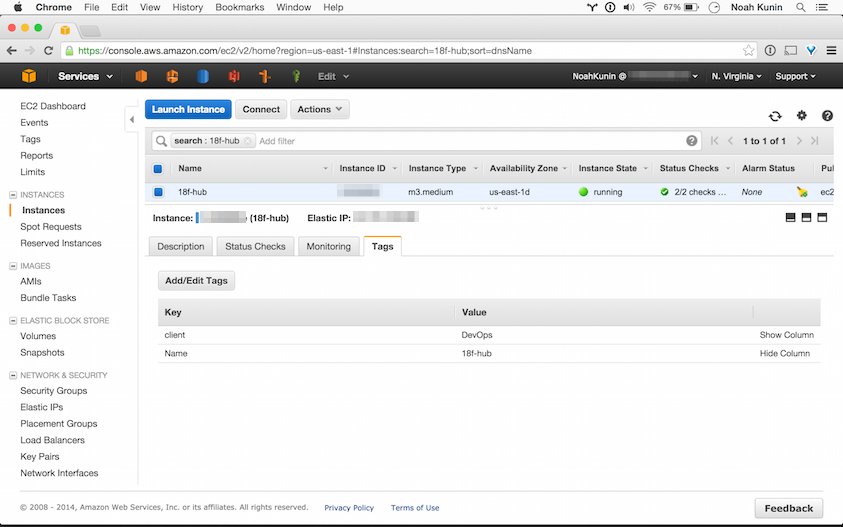

# {{ page.title }}

At 18F, we use [Amazon Web Services](http://aws.amazon.com/) (AWS) as our
[infrastructure as a service](http://en.wikipedia.org/wiki/Cloud_computing#Infrastructure_as_a_service_.28IaaS.29)
(IaaS). AWS hosts not just our production systems, but everything else too:
development, staging, testing, etc. If you're used to developing locally, you
should feel empowered to do everything in AWS if you'd like. Note that AWS is
currently the **only** approved IaaS provider. You're free to develop purely
locally as long as you'd like, but if you want to get something online, AWS is
the only option.

Even if you are familiar with IaaS providers in general, or AWS specifically,
before you are given access you **must go through on-boarding with the 18F
DevOps team**.

Sometime in 2015, this on-boarding will be part of 18F On-boarding
for all relevant staff. If you're reading this now, need access, and haven't
gone through the training, jump into the #devops channel in Slack to arrange
for a session.

## Fundamentals

If you are familiar with running virtual machines on your own computer,
through Parallels, Virtualbox, or VMWare, AWS operates on the same principles
but on a truly massive [scale](http://www.enterprisetech.com/2014/11/14/rare-peek-massive-scale-aws/).
Pretty much everything in AWS can be orchestrated via the [AWS API](https://aws.amazon.com/documentation/)
& [command-line interface](http://docs.aws.amazon.com/cli/latest/reference/).

### Log-in

We don't use the standard AWS log in site. You will need to go to **[https://18f.signin.aws.amazon.com/console]( https://18f.signin.aws.amazon.com/console)** to log in.

Your username will be created for you during onboarding. Check the MFA Token box on the login form, and enter your information from Google Authenticator, Authy, or another OTP app.

### Servers

The core service of AWS is the [Elastic Compute Cloud](http://aws.amazon.com/documentation/ec2/) (EC2).
These are virtual machines just like on your computer, but hosted in the AWS
environment. You receive access through a GUI, the [AWS Management Console](https://18f.signin.aws.com),
an [API](http://docs.aws.amazon.com/AWSEC2/latest/APIReference/query-apis.html),
and to the guest [OS through SSH](http://docs.aws.amazon.com/AWSEC2/latest/UserGuide/AccessingInstancesLinux.html).

### Network security

At 18F, we require all EC2 instances to be launched into a [virtual private cloud](http://aws.amazon.com/vpc/)
(VPC). Your network security settings are set at the VPC level: on what
ports, from what IP addresses, can EC2 instances communicate with each other
and back out to the internet. Occasionally, out-of-date documentation from
third parties and Amazon itself may reference *EC2 Classic*. We at 18F do not
support this environment.

### Object storage

If you want very basic and cheap object storage, AWS provides the [Simple Storage Service](http://aws.amazon.com/s3/) (S3).

### Permissions

AWS [Identity and Access Management](http://aws.amazon.com/iam/) IAM is where  all permissions are set, both for human users and EC2 instances themselves if they need to communicate commands to other AWS services. Currently, modifications to anything under IAM must go through 18F DevOps.

These are just the concepts necessary for initial on-boarding. AWS has an
[extensive list](http://aws.amazon.com/products/) of other services.

## Constraints

There are a few special notes on using any IaaS in the Federal context.

### Other people's money

The Federal Government cannot pay one penny more than it is authorized to spend. There is no retroactive justification for spends. When Government exceeds these limits, a report report and explanation is required to the GSA Administrator, General Counsel, and Congress. So tracking costs is a *big deal*.

Every inter-agency agreement (IAA) at 18F needs to have a line item on a total value to spend on infrastructure, including Amazon Web Services (AWS). Unless it is part of a negotiation with 18F DevOps, we *do not* pay for non-production hosting costs. All costs must go back to the Federal partner or another funding source. There is no actual concept of _non-billable_ - there are only costs that are directly or indirectly billable. If we don't bill a funding source, it means that 18F's rates must go up that next fiscal year in order indirectly recoup costs.

For AWS, the cost of almost every service can be tracked through the usage of **tags**. Tags are just simple `key`:`value` pieces of metadata. Unfortunately, there does not seem to be any canonical list of which AWS services supports tags, nor is there any consistent way within the AWS Management Console of each particular service to apply or change a tag. Once you gain access to the AWS Management Console, you can click on various resources and see if a *Tags* tab or link is available. In this example, the 18F Hub site has two tags:

AWS has recently deployed significant improvements for tag management. There is now a [global viewer and editor](https://resources.console.aws.amazon.com/r/tags) for all tags.

The most important resources to tag are [EC2 instances](https://docs.aws.amazon.com/AWSEC2/latest/UserGuide/Using_Tags.html) and [RDS instances] (https://docs.aws.amazon.com/AmazonRDS/latest/UserGuide/USER_Tagging.html). You should also consult the AWS documentation of the service you're using.

#### Format for the `client` tag

18F DevOps maintains a [list of canonical unique identitifers](https://docs.google.com/a/gsa.gov/spreadsheet/ccc?key=0AinIxtx-CfkddGVaNU9lMHp3TGh2RThEVWExS0dwNmc#gid=17) (UIDs) to use for all the `client` tags of a project. The UID is formed from an acronym of the Federal partner, the start date of the IAA, the end date of the IAA, and a number that increments with each subsequent IAA. While we might be able to have teams self-provision the UID in the future, for now, please only use the [UIDs on the list](https://docs.google.com/a/gsa.gov/spreadsheet/ccc?key=0AinIxtx-CfkddGVaNU9lMHp3TGh2RThEVWExS0dwNmc#gid=17). If you see your project missing, please contact the Director of Delivery Architecture in Slack.

Note that both the `key` and the `value` of AWS tags are *case-sensitive*. Keep keys and values as all lower-case, except when using an acronym.

### Other people's information

Any system in AWS might have the public's information (as opposed to *public*
data) at any time. Some systems, like [MyUSA](https://github.com/18F/myusa),
use row-level encryption to help protect that information. Depending on the
data being stored, others may not, and you may have access to the underlying
data in order to do your job.

In order to make sure we are protecting the privacy and integrity of the
public's data, *you have no expectation of privacy on these systems*.
Everything you do on these systems is subject to monitoring and auditing. Use
common sense when handling this information. Unless you have permission *and*
need to in order to do your job:

* Don't release information
* Don't share information
* Don't view information

Regardless of your own norms around privacy, always assume the owner of that
data has the most conservative requirements unless they have taken express
action, either through a communication or the system itself, telling you
otherwise.

We also take particular care in protecting sensitive personally identifiable
information (PII). PII is any information that can be linked back to an
individual. For example, this includes a person's full name, their home
address, and their phone number.

**Sensitive PII** is information which if lost, compromised, or
disclosed without authorization, could result in substantial harm, embarrassment,
inconvenience, or unfairness to an individual. While this is inherently a
subjective definition, there are certain types of information we *always*
treat as Sensitive PII:

* Driver's license or state identification number
* Social security number (SSN)
* Financial account number(s)
* Alien Registration Number
* Passport number
* Biometric identifiers

Because we live in an increasingly connected world, sometimes sensitive PII
can be created by pairing different types of PII. These types of PII become
sensitive if paired:

* Citizenship or immigration status
* Ethnic or religious affiliation
* Mother's maiden number
* Last 4 digits of SSN
* Medical information
* Sexual orientation
* Account passwords
* Criminal history
* Date of birth

Sensitive PII **cannot be on a system unless it has received an Authority to
Operate [xlink here].** If you are uncertain if the information you want to
work with is Sensitive PII in your context, speak with 18F DevOps beforehand.

### Security

Once you gain access to AWS, you will find yourself responsible for some serious
stuff.

#### Environmental variables

These are things like your AWS password, secret API key, and the mobile
device that generates your multi-factor authentication token. You are wholly
and solely responsible for safeguarding them, and are responsible if they are
released to non-authorized parties. If you are unfamiliar with how to protect
these variables, please consult with 18F DevOps. We're working on getting
additional tools to help make this easy for everyone.

#### OS baseline

We use a pre-hardened version of [Ubuntu](http://en.wikipedia.org/wiki/Ubuntu_%28operating_system%29)
as our baseline OS for all EC2 instances in AWS. In AWS, there are
[Amazon Machine Images](http://docs.aws.amazon.com/AWSEC2/latest/UserGuide/AMIs.html)
(AMIs) in each AWS Region that these controls already implemented. You should
always launch new instances from this baseline.

#### HTTPS Everywhere

Regardless of what your system does, we enforce [HTTPS Everywhere](https://18f.gsa.gov/2014/11/13/why-we-use-https-in-every-gov-website-we-make/).

## Demo agenda

#### All Services
* Tags for `Name` and `client` _must_ be set if available.

#### VPCs
* Create a VPC with both private and public subnets
* Create a security group

#### EC2
* Generate a new keypair with naming convention.
* Launch a basic EC2 instance into the VPC, with the security group set
* Remind that all connections must be set only for what is necessary. Explain
the function of the  0.0.0.0/0 block - only applies to inbound/outbound to
the internet on port 80/443 for HTTP/HTTPS. Everything else should be
expressly set.
* If keypairs must be shared, only authorized way to share them is through
GSA Google Drive (create a folder, share it with your coworker, delete the
file once they have it)
* Setup and successfully SSH in
* Generate an ssh key for further use & install in `authorized_keys`

#### CloudWatch
* Review basic CloudWatch monitoring
* Setting a CloudWatch alarm for a metric

#### Elastic Load Balancers (ELBs) and Elastic IPs (EIPs)
* Explain ELB concept
* Create an additional EC2 instance
* Create an ELB
* Associate them with the ELB
* Note that IPs of EC2 instances may change with stop and restart.
* ELBs have fully qualified domain names (FQDN ) that *do not* change.
* Other alternative when necessary: Elastic IPs. Precious resource.

#### HTTPS Everywhere

* Review settings for ELBs and Nginx

#### Create IAM users
* First name + Last Name in camel case. Ex: NoahKunin
* Have AWS create temporary password, require user to change it during first login
* Tell/show user IAM password policy
* Create and sync MFA tokens

If time allows:

#### Cloudformation
* JSON manifests
* Creating a stack
* Checking what was created
* Deleting the entire stack

#### Relational Database Service (RDS)
* TBD

### Cleanup
* Delete all the demo stuff
